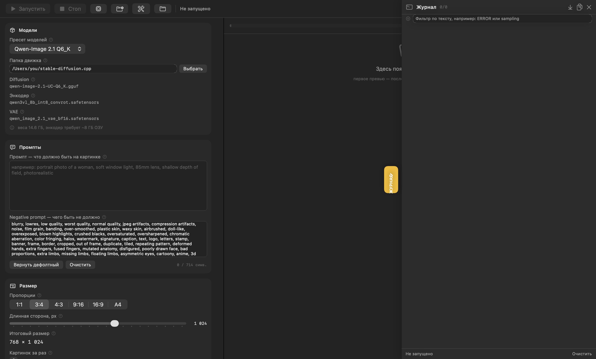

# Diffusion Studio

[](https://www.apple.com/macos/)
[](https://swift.org/)
[](LICENSE)

Локальный macOS-клиент для [stable-diffusion.cpp](https://github.com/leejet/stable-diffusion.cpp).

Никаких серверов, API-ключей и облачной подписки: приложение запускает локальный
`sd-server` у вас на машине и показывает прогресс и журнал. Всё, что вы вводите, остаётся
на этом компьютере.



## Зачем

`sd-cli` — мощный инструмент, но подобрать параметры руками неудобно: команда на два экрана,
результат виден только в конце. Diffusion Studio превращает это в обычную панель настроек:

- один запуск — один клик, без терминала;
- веса модели держатся в памяти между запусками: вторая картинка не читает 14.6 ГБ заново;
- честная оценка оставшегося времени **по замерам на вашей машине**;
- журнал с фильтром, копированием и подсветкой ошибок — сбоку, чтобы не забирать место;
- пресеты параметров, которые переживают перезапуск.

## Требования

| | |
|---|---|
| macOS | 14.0 Sonoma или новее |
| Архитектура | собирается под текущий процессор (`x86_64` или `arm64`) |
| Инструменты | Command Line Tools (`xcode-select --install`) |
| Диск | ~20 ГБ под веса модели |
| ОЗУ | ~22 ГБ свободных для Qwen-Image 2.1 Q6_K на CPU |

Нужен именно бинарь `sd-server`, а не только `sd-cli`: приложение держит его запущенным
между картинками, чтобы веса модели не перечитывались с диска.

```bash
cd stable-diffusion.cpp/build && make sd-server -j8
```

Собранный `stable-diffusion.cpp` с моделями в `models/` должен лежать в одной папке.
Приложение находит её само и менять её не нужно — настраивается только папка, куда
складывать готовые картинки.

Модели, которые приложение ожидает по умолчанию:

- `qwen-image-2.1-UC-Q6_K.gguf` — диффузия, ~5.6 ГБ
- `qwen3vl_8b_int8_convrot.safetensors` — текстовый энкодер, ~9.35 ГБ
- `qwen_image_2.1_vae_bf16.safetensors` — VAE, ~675 МБ

Любую другую модель можно выбрать вручную: пресет моделей — не ограничение, а набор
имён файлов.

## Сборка

```bash
./build.sh
open "build/Diffusion Studio.app"
```

Сборка занимает около минуты, Xcode не нужен. Скрипт компилирует нативный бинарник,
генерирует иконку, если её ещё нет, и делает ad-hoc подпись.

## Где хранятся файлы

**Папка движка** (`stable-diffusion.cpp`) фиксирована и в интерфейсе не меняется. Приложение
находит её сама: сначала переменная окружения, потом локальная сборка, потом типовые места
установки (`~/stable-diffusion.cpp`, `~/Developer/…`, `/opt/homebrew/…`). Текущий путь
показан в разделе «Модели» — только чтобы было видно, куда оно смотрит.

Если движок переехал, задайте путь один раз при запуске:

```bash
DIFFUSION_STUDIO_ROOT=/путь/к/stable-diffusion.cpp open "build/Diffusion Studio.app"
```

**Папка для картинок** — единственное, что настраивается. Кнопка с папкой в тулбаре и
кнопка в разделе «Сохранение» открывают системный выбор; путь сохраняется между запусками.
По умолчанию — `outputs/` внутри папки движка.

## Что означают параметры

**Размер.** Любой размер округляется до кратных 64 — этого требует сетка модели.
Рабочий размер для быстрого результата — 768×1024, черновики удобнее делать на 512×512.

**Шаги.** 16–24 — рабочий диапазон. Ниже 12 появляются артефакты связности, выше 32
качество уже не растёт, а время продолжает расти.

**CFG.** Для Qwen-Image держите 3.5–4.5. Ниже 2 изображение «уходит» от промпта,
выше 7 появляются пересыщение и артефакты.

**Flow shift.** Около 3.0. Влияет на контраст и чистоту фона.

**Сид.** Одинаковый сид при одинаковых параметрах даёт воспроизводимый результат —
удобно перебирать формулировки промпта. В режиме «случайный» пишется `-1`.

**Превью.** `sd-server` не умеет отдавать промежуточные картинки: сервер отвечает только
готовым PNG. Поэтому картинка появляется в конце генерации, а за ходом работы следит
полоса прогресса с разбивкой по стадиям и журнал.
Режимы `tae` и `vae` дают честную картинку, но декодируют её десятки минут.

## Производительность: ожидайте честных цифр

Qwen-Image 2.1 Q6_K на CPU — это **дни, не минуты**. Замеры на MacBook Pro 2019
(Radeon Pro 5500M, 8 ГБ VRAM, 32 ГБ RAM):

| Параметры | Результат |
|---|---|
| 512×512, 8 шагов | 2 ч 1 мин |
| 768×1024, 24 шага | 7 ч 33 мин |
| 256×256, 1 шаг (сквозной тест) | 8 мин 14 с |

Почему не GPU: встроенная графика десктоп оставляет ~700 МБ свободной VRAM, а модель
занимает больше 14 ГБ. Metal и auto-fit падают на инициализации рабочего пространства,
поэтому по умолчанию выбран CPU.

Скорость сильно зависит от свободной памяти. Если в своп уходит больше пары гигабайт,
шаг становится в разы длиннее — приложение показывает текущий расход свопа в блоке
оценки. Перед долгой генерацией закройте браузер с тяжёлыми вкладками и мессенджеры.

Если у вас дискретная карта с 8 ГБ VRAM и более, попробуйте режим `Auto-fit (GPU)` и
ограничьте `--max-vram`. Подбирать придётся экспериментально.

## Журнал

Выезжает справа по кнопке на правом краю окна или по `⌘L`, состояние запоминается.
Внутри: фильтр по подстроке, копирование, очистка, автопрокрутка, подсветка строк
`[ERROR]` и `[WARN]`. Полный вывод `sd-server` пишется в память (до 5000 строк) и в
`outputs/` рядом с результатом.

## Ключи

| | |
|---|---|
| `⌘↩` | запустить генерацию |
| `⌘L` | открыть/скрыть журнал |

## Тесты

```bash
# 27 проверок: сборка аргументов, округление размеров, валидация, парсер прогресса
swiftc -O -swift-version 5 -target "$(uname -m)-apple-macosx14.0" \
  -o /tmp/ds_selftest Sources/Settings.swift Sources/Runner.swift Sources/Presets.swift Tests/selftest/main.swift
/tmp/ds_selftest

# сквозной тест: реальный запуск sd-server 256×256, 1 шаг, два раза подряд (~10 минут)
swiftc -O -swift-version 5 -target "$(uname -m)-apple-macosx14.0" \
  -o /tmp/ds_e2e Sources/Settings.swift Sources/Runner.swift Tests/e2e/main.swift
/tmp/ds_e2e

# снимок интерфейса без запуска приложения (нужен для скриншотов в документации)
swiftc -O -swift-version 5 -target "$(uname -m)-apple-macosx14.0" \
  -o /tmp/render_panel Sources/Settings.swift Sources/Runner.swift Sources/Presets.swift \
  Sources/RootView.swift Tools/render_panel.swift
/tmp/render_panel /tmp/ui.png 1440 900 sidebar
```

## Устройство проекта

```
Sources/Settings.swift   параметры, валидация, оценка времени, тело запроса к серверу
Sources/Runner.swift     постановка задачи в sd-server, разбор лога, прогресс, отмена
Sources/EngineServer.swift запуск и остановка sd-server, submit/poll/cancel, память процесса
Sources/Progress.swift    веса стадий, кривые сэмплирования и декодирования, живая калибровка
Sources/Presets.swift    сохранение наборов параметров в UserDefaults
Sources/RootView.swift   интерфейс: панель параметров, вывод, сайдбар журнала
Sources/App.swift        точка входа
Tools/make_icon.swift    генератор иконки (кодом, без бинарных ассетов в репозитории)
Tools/render_panel.swift офлайн-снимок интерфейса
Tests/                   юнит-тесты и сквозной тест
```

Аргументы командной строки собираются в массив и передаются в `Process` напрямую, без
оболочки: путь к модели или промпт не могут превратиться в команду.

## Оговорка про содержимое изображений

Приложение не проверяет промпт и не фильтрует результат. Всё, что выводится, вы
генерируете сами и отвечаете за это сами — в том числе сходство с реальными людьми,
документами и товарными знаками.

## Лицензия

MIT — см. [LICENSE](LICENSE).

`stable-diffusion.cpp` распространяется отдельно под собственной лицензией MIT.
Веса моделей — отдельные файлы со своими условиями; проверяйте лицензию модели перед
публичным использованием результата.